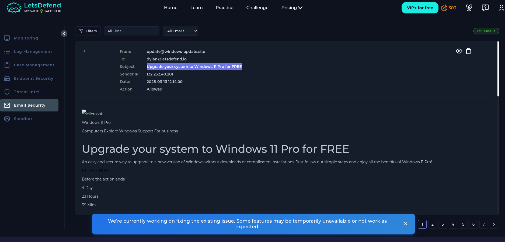
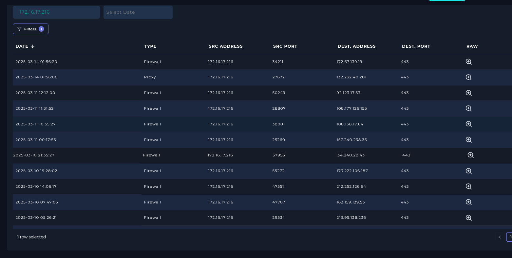
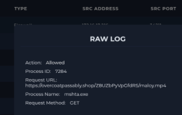

# 🚨 SOC Case 020 — Phishing Investigation

> **Case Type:** Phishing & Malicious URL Investigation
> **Severity:** 🟠 Medium
> **Status:** 🟢 Closed
> **Environment:** Authorized Security Lab

## 🎯 Executive Summary

A user received a phishing email impersonating a Windows 11 upgrade notification.

The investigation identified a suspicious sender, malicious URL, and related network activity.

**Endpoint compromise was not confirmed based on the available evidence.**

## 🧩 Investigation Scenario

The email claimed that a Windows 11 upgrade was available and contained a suspicious link.

### Objectives

* Analyze the phishing email
* Identify suspicious indicators
* Investigate the URL and domain
* Review related network activity
* Assess potential endpoint compromise
* Document SOC response actions

## 🔎 Key Findings

| Finding                | Result                    |
| ---------------------- | ------------------------- |
| 📧 Phishing email      | Confirmed                 |
| 👤 Suspicious sender   | Identified                |
| 🌐 Malicious URL       | Identified                |
| 💻 Browser access      | Observed via `chrome.exe` |
| 🌐 HTTP response       | `200 OK`                  |
| 🚨 Endpoint compromise | **Not confirmed**         |

## 🧬 Indicators of Compromise

| Type   | Indicator                      |
| ------ | ------------------------------ |
| Sender | `update@windows-update.site`   |
| Domain | `windows-update.site`          |
| URL    | `https://windows-update.site/` |
| IP     | `132.32.40.201`                |

> ⚠️ These indicators belong to an authorized security lab.

## 🛰️ Investigation Flow

```text
Phishing Email
      ↓
Sender Analysis
      ↓
URL Extraction
      ↓
Domain Investigation
      ↓
Network Activity Review
      ↓
IOC Extraction
      ↓
Endpoint Assessment
      ↓
SOC Decision
```

## 🛡️ SOC Actions

### 01 — Analyze

Reviewed the phishing email and suspicious URL.

### 02 — Extract

Identified the sender, domain, URL, and IP indicators.

### 03 — Correlate

Reviewed related network and endpoint activity.

### 04 — Assess

Evaluated whether the available evidence supported endpoint compromise.

### 05 — Respond

Recommended blocking the identified indicators and containing the phishing activity.

## 🧠 Analyst Assessment

### Confirmed

* Phishing email was delivered.
* Suspicious sender was identified.
* Malicious URL was identified.
* URL access occurred through `chrome.exe`.

### Not Confirmed

* Successful endpoint compromise
* Credential theft
* Malware execution
* Persistence

> **Analyst principle:** Suspicious activity is not automatically evidence of compromise.

## 📋 Recommended Response

* Block the malicious domain and URL.
* Block identified indicators where appropriate.
* Remove the phishing email from affected mailboxes.
* Monitor for additional access attempts.
* Review authentication activity for affected users.
* Educate the affected user.
* Continue monitoring for related indicators.

## 📚 Investigation Evidence

### 📧 01 — Phishing Email

The initial phishing message impersonated a Windows 11 upgrade notification.



**Observed:**
- Suspicious sender domain
- Windows upgrade impersonation
- Embedded malicious link
- Sender IP identified

---

### 🌐 02 — URL Access & Network Activity

Network logs were reviewed to identify connections associated with the suspicious URL.



**Observed:**
- Internal source host
- HTTPS connection
- Destination IP correlation
- Network activity associated with the investigation

---

### 🔎 03 — Raw Network Evidence

Raw log data was reviewed to validate the observed network activity.



**Observed:**
- Process information
- Request method
- Destination details
- Raw event evidence

---

### 🧭 Evidence Chain

```text
📧 Phishing Email
       ↓
🌐 Malicious URL
       ↓
📊 Network Activity
       ↓
🔎 Raw Log Analysis
       ↓
🧠 Analyst Assessment
       ↓
🛡️ Response Recommendation
