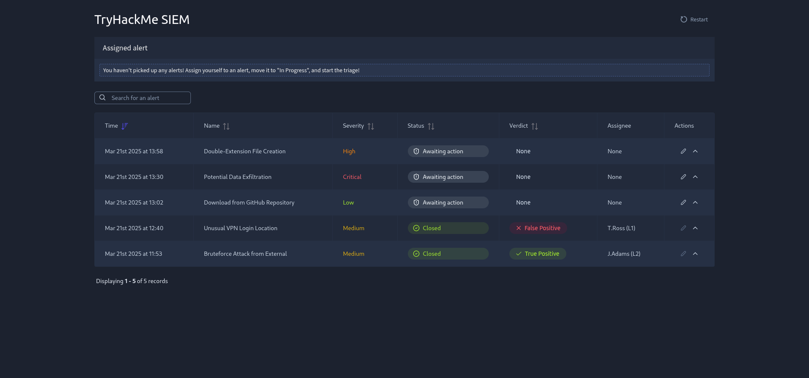
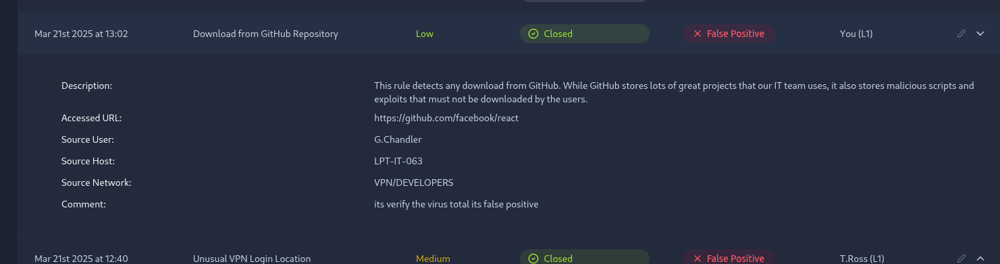

# 🚨 SOC Case 021 — Alert Triage & Network Investigation

> **Case Type:** SOC Alert Triage & Network Investigation
> **Severity:** 🟠 Medium
> **Status:** 🟢 Investigation Complete
> **Environment:** Authorized Security Lab
> **Platform:** TryHackMe SOC Level 1

---

## 🎯 Executive Summary

This investigation focused on triaging a SOC alert and determining whether the observed activity represented a true positive or false positive.

The investigation combined endpoint process analysis, PID/PPID relationships, PowerShell activity, network correlation, DNS and IP analysis, proxy telemetry, IOC identification, and AI-assisted investigation.

> **Analyst Principle:** AI can accelerate investigation, but conclusions must be validated against actual telemetry and evidence.

---

## 🧩 Investigation Scenario

A security alert required investigation to determine:

* What triggered the alert?
* Which process generated the activity?
* What was the parent process?
* Was the activity malicious or benign?
* Did the endpoint communicate with suspicious infrastructure?
* What indicators could be extracted?
* What response should a SOC analyst recommend?

---

## 🔎 Key Findings

| Finding                    | Result                      |
| -------------------------- | --------------------------- |
| 🚨 SOC alert               | Investigated                |
| 🎯 Alert severity          | Prioritized                 |
| 🧩 Process activity        | Analyzed                    |
| 🌳 PID / PPID relationship | Investigated                |
| ⚡ PowerShell activity      | Reviewed                    |
| 🌐 Network activity        | Correlated                  |
| 🔎 DNS / IP activity       | Investigated                |
| 🧬 IOC identification      | Performed                   |
| 🤖 AI-assisted analysis    | Validated against telemetry |

---

## 🛰️ Investigation Flow

```text
SOC Alert
    ↓
Initial Triage
    ↓
Severity Assessment
    ↓
Process Investigation
    ↓
PID / PPID Analysis
    ↓
PowerShell Investigation
    ↓
Network Correlation
    ↓
DNS / IP / Proxy Analysis
    ↓
IOC Identification
    ↓
Analyst Assessment
    ↓
Response Recommendation
```

---

## 🛡️ SOC Triage

### 01 — Alert Prioritization

The initial alert was reviewed to determine its urgency and potential impact.

### 02 — True Positive / False Positive

The available telemetry was evaluated to determine whether the alert represented:

* Confirmed malicious activity
* Suspicious activity requiring additional investigation
* Benign activity / false positive

### 03 — Evidence Collection

Relevant endpoint and network telemetry was collected before reaching a final conclusion.

---

## 🧩 Process Investigation

The process responsible for the observed activity was investigated using:

* Process ID (PID)
* Parent Process ID (PPID)
* Process name
* Command-line behavior
* Parent-child relationships

### Process Investigation Model

```text
Parent Process
      ↓
Child Process
      ↓
Command Line
      ↓
Behavior
      ↓
Network Activity
      ↓
Analyst Assessment
```

> **Key principle:** Process context provides important evidence when determining whether activity is suspicious.

---

## ⚡ PowerShell Investigation

PowerShell activity was reviewed as part of the endpoint investigation.

The analysis considered:

* PowerShell execution
* Command-line behavior
* Parent-process context
* Suspicious execution patterns
* Related network activity

Suspicious PowerShell behavior was not treated as automatically malicious. Context and supporting telemetry were required for assessment.

---

## 🌐 Network Correlation

Endpoint activity was correlated with network telemetry to determine whether the process communicated with external infrastructure.

### Investigation Areas

| Area         | Purpose                             |
| ------------ | ----------------------------------- |
| DNS          | Identify domain resolution          |
| IP           | Identify destination infrastructure |
| Proxy        | Review web communication            |
| Network Logs | Correlate connection activity       |
| IOC Analysis | Identify suspicious indicators      |

---

## 🧬 Indicators of Interest

| Type    | Value                              | Relevance   |
| ------- | ---------------------------------- | ----------- |
| IP      | `[Extracted during investigation]` | `[Purpose]` |
| Domain  | `[Extracted during investigation]` | `[Purpose]` |
| URL     | `[Extracted during investigation]` | `[Purpose]` |
| Process | `[Observed process]`               | `[Purpose]` |

> ⚠️ Indicators should be copied from the investigation evidence rather than manually invented.

---

## 🤖 AI-Assisted SOC Investigation

AI assistance was used to accelerate parts of the investigation and organize analytical reasoning.

### AI-assisted tasks

* Alert interpretation
* Investigation guidance
* Evidence organization
* Hypothesis generation
* Query assistance
* Investigation documentation

### Analyst Validation

AI-generated conclusions were treated as **investigation assistance, not authoritative evidence**.

Final conclusions were based on actual:

**Endpoint Telemetry → Process Data → Network Data → IOC Evidence**

---

## 🧠 Analyst Assessment

### Confirmed

* The alert was investigated using endpoint and network telemetry.
* Process relationships were analyzed.
* Network activity was correlated with endpoint behavior.
* Relevant indicators were identified where supported by evidence.

### Requires Further Investigation

* [Insert unresolved finding if applicable]
* [Insert additional investigation requirement]

### Not Confirmed

* [Insert activity that could not be established]
* [Insert unsupported conclusion]

> **Analyst Principle:** Never determine maliciousness from a single indicator. Evaluate behavior in context.

---

## 📋 Recommended Response

For a production alert showing similar behavior:

1. Review the triggering alert and associated telemetry.
2. Investigate the initiating process and parent process.
3. Review PowerShell command-line activity where applicable.
4. Correlate endpoint activity with DNS, proxy, and network logs.
5. Extract and investigate relevant IOCs.
6. Determine whether containment or escalation is required.
7. Continue monitoring for related activity.

---

## 📚 Investigation Evidence

### 🔎 Evidence 01 — SOC Alert

[Describe what the alert shows.]



---

### 🔎 Evidence 02 — Alert Prioritization

[Describe the alert severity and triage decision.]


---

### 🔎 Evidence 03 — Process Investigation

[Describe the process and parent-process evidence.]


---

### 🔎 Evidence 04 — GitHub / Investigation Evidence

[Describe the supporting investigation evidence.]



---

## 🧭 Evidence Chain

```text
🚨 Alert
   ↓
🧩 Process Context
   ↓
⚡ PowerShell Activity
   ↓
🌐 Network Correlation
   ↓
🧬 IOC Identification
   ↓
🧠 Analyst Assessment
   ↓
🛡️ Response Decision
```

---

## 💡 Key Lessons

### 01 — Triage Before Investigation

Alert severity helps determine what to investigate first.

### 02 — Evidence Determines the Conclusion

A suspicious alert is not automatically proof of compromise.

### 03 — Context Matters

PID/PPID relationships, process behavior, and network activity provide valuable context.

### 04 — AI Requires Analyst Validation

AI can accelerate investigation, but the analyst remains responsible for validating conclusions against real telemetry.

---

## 🔐 Ethics & Lab Scope

This investigation was conducted in an authorized security training environment for educational and defensive security purposes.

No unauthorized systems, accounts, infrastructure, or data were targeted.

---

## ✅ Case Status

**🟢 INVESTIGATION COMPLETE**

`SOC-021` · `Alert Triage` · `Network Investigation` · `Endpoint Analysis` · `AI-Assisted SOC`
