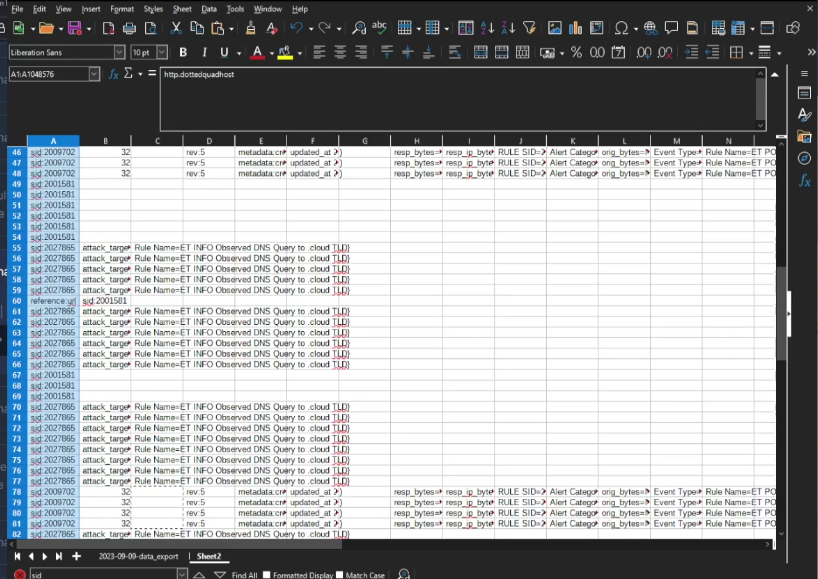
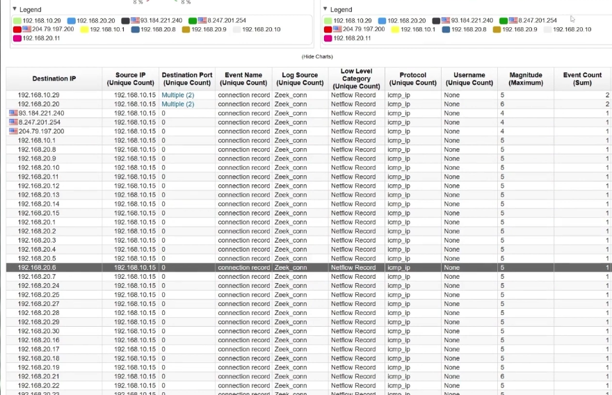

# Module 01 | QRadar Log Sources & Network Investigation

QRadar investigation starts by understanding what telemetry is available and then narrowing the dataset around suspicious infrastructure.

## Q1 | Log sources

**Finding:** `15` log sources.

The lab contained multiple telemetry types, allowing endpoint, authentication and network activity to be correlated.

## Q2 | Network IDS

**Finding:** `Suricata`

Suricata provided network detection telemetry that could be correlated with QRadar events.

## Q3 | Domain

**Finding:** `HACKDEFEND.local`

The internal domain provides useful context for Windows users, hosts and administrative activity.

## Q4 | Malicious server

**Finding:** `192.168.20.20`

The malicious server was identified by reviewing communications with the suspicious infrastructure and comparing source IPs.

## Q5 | Most frequent alert rule

**Finding:** SID `2027865`

The repeated alert was:

`ET INFO Observed DNS Query to .cloud TLD`

### Evidence

## Q6 | Attacker IP

**Finding:** `192.20.80.25`

The attacker address was determined by correlating the offense and source-IP activity rather than assuming the most visible source in a single table.

## Q8 | First infected machine

**Finding:** `192.168.10.15`

This host becomes a key pivot for the remainder of the investigation.

## Q12 | First malicious connection to domain controller

**Finding:** `11:14:10`

The timestamp was obtained by narrowing network activity to the domain controller and identifying the first malicious connection.

## Q15 | Host discovery protocol

**Finding:** `icmp`

ICMP connection records showed the attacker probing hosts as part of host discovery.

## Q23 | Scanned network

**Finding:** `192.168.20.0`

The host-discovery activity showed the attacker scanning the `192.168.20.x` network range.

### Evidence

## Lesson

Network telemetry becomes much more useful when source IP, destination IP, protocol and timestamps are correlated with endpoint events.
