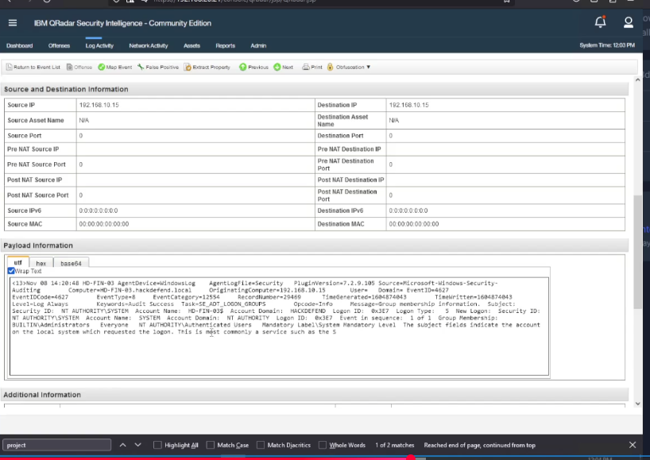
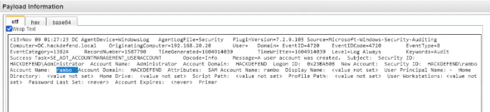

# Module 02 | Windows Identity & Account Activity

Windows Security events provide the identity context needed to determine which employee and accounts were involved.

## Q9 | Infected employee

**Finding:** `nour`

The compromised machine was `192.168.10.15`, and the Windows Security event identified the affected user as `nour`.

### Evidence

## Q11 | Second targeted system

**Finding:** `MGNT-01`

The attacker targeted the management system to cover activity associated with the employee.

The related host telemetry included IP `192.168.13.11` and the hostname `mgmt-01.hackdefend.local`.

## Q18 | New account

**Finding:** `rambo`

Windows Security **Event ID 4720** showed that a new account named `rambo` was created.

### Evidence

## Q22 | Other legitimate domain administrator

**Finding:** `Adam`

The investigation identified `Adam` as the other legitimate domain administrator besides `Administrator`.

## Q24 | Employee who hired the attacker

**Finding:** `Sami`

The lab evidence identified Sami as the employee connected to the attacker hiring scenario.

## Lesson

Do not treat every privileged-looking account as malicious. Separate legitimate administrators, service accounts and newly created accounts using event context, timestamps and account history.
