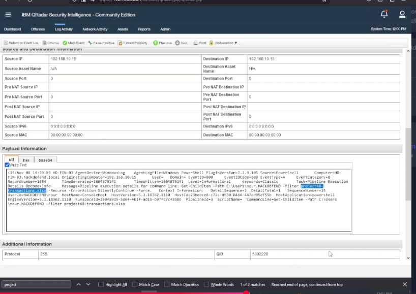

# Module 03 | PowerShell & Defense Evasion

PowerShell telemetry can reveal reconnaissance and attempts to determine whether security controls are enabled.

## Q7 | Project searched by the attacker

**Finding:** `project48`

The PowerShell command searched recursively under the user's profile:

`Get-ChildItem -Path C:\Users\nour.HACKDEFEND -Filter project48 -Recurse -ErrorAction SilentlyContinue -Force`

This is reconnaissance for a specific business project.

### Evidence

## Q10 | Logging checked by the attacker

**Finding:** PowerShell Script Block Logging

The attacker checked the registry path:

`HKLM\Software\Policies\Microsoft\Windows\PowerShell\ScriptBlockLogging`

The behavior indicates an attempt to determine whether PowerShell Script Block Logging was enabled.

## Q16 | Company email service

**Finding:** `office365`

The company email service was identified as Office 365.

## Lesson

PowerShell commands should be interpreted in context. Discovery of business data and inspection of logging controls can become significant when they occur near malware execution and persistence.
