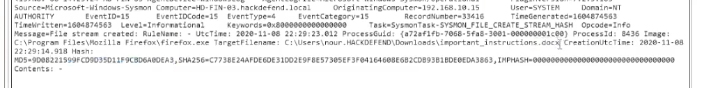
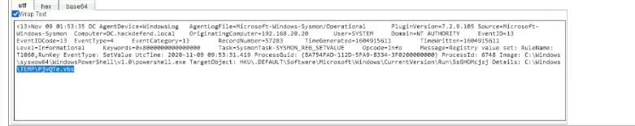

# Module 04 | Malware, File Evidence & Persistence

File telemetry and registry modifications provide strong evidence for malware execution and persistence.

## Q13 | Malicious file MD5

**Finding:**

`9D08221599FCD9D35D11F9CBD6A0DEA3`

The malicious file was observed through Sysmon file telemetry.

### Evidence

## Q14 | MITRE persistence technique

**Finding:** `T1547.001`

Sysmon **Event ID 13, Registry Value Set** showed a Run Key modification:

`HKU\.DEFAULT\Software\Microsoft\Windows\CurrentVersion\Run\SsGHOMcjsj`

The value executed:

`C:\Windows\TEMP\PjvQTe.vbs`

The event's older rule reference was `T1060,RunKey`; the current MITRE ATT&CK technique is **T1547.001 - Registry Run Keys / Startup Folder**.

### Evidence

## Q17 | Initial malicious file

**Finding:** `important_instructions.docx`

The file was observed under:

`C:\Users\nour.HACKDEFEND\Downloads\important_instructions.docx`

## Lesson

A legitimate Windows persistence location can still be abused. The key question is what value was added, what file it launches, where that file resides and how the registry modification relates to the preceding process activity.
