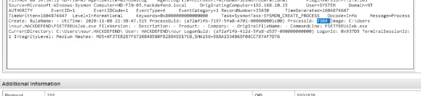

# Module 05 | Execution, Lateral Movement & Exfiltration

The later stages of the investigation show how the attacker moved from endpoint execution into movement and data theft.

## Q19 | Process injection PID

**Finding:** `7384`

Sysmon process telemetry identified Process ID `7384` for the process associated with the injection activity.

### Evidence

## Q20 | Lateral movement tool

**Finding:** `wmiexec.py`

The attacker used `wmiexec.py` for lateral movement.

## Q21 | Exfiltration tool

**Finding:** `curl`

The attacker used `curl` to exfiltrate a file.

## Lesson

Tool names alone are not enough. Correlate the tool with the process, source host, destination, timestamp and surrounding commands to establish malicious use.
